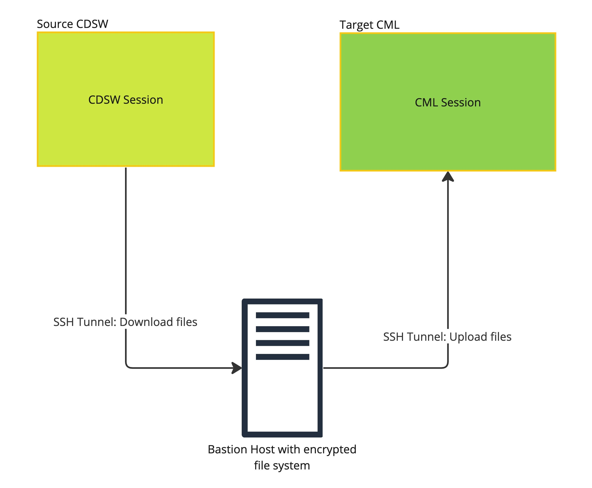

# **cmlutil** 

`cmlutil` is a command-line interface (CLI) tool designed to enhance the [Cloudera Machine Learning (CML)](https://docs.cloudera.com/machine-learning/cloud/index.html) experience. It provides various utilities and functionalities to help working with Cloudera Machine Learning.

`cmlutil project` command helps to migrate a CDSW/CML [projects](https://docs.cloudera.com/machine-learning/cloud/projects/index.html)
(along with associated assets like [models](https://docs.cloudera.com/machine-learning/cloud/models/index.html),
[jobs](https://docs.cloudera.com/machine-learning/cloud/jobs-pipelines/index.html) and [applications](https://docs.cloudera.com/machine-learning/cloud/applications/index.html))
to another CML workspace. This tool aims to solve for migrating projects from legacy CDSW clusters (which will be EOL'd soon)
to CML public cloud/private cloud. The tool uses the host it is running on as its "scratch space" for temporarily holding project
data and metadata before the project is fully migrated to the target CML workspace. This host is interchangeably referred to as "Bastion host" or "local machine" in this document.

## Preqequisites to running this tool:
System Requirements:
1. You should be running a UNIX like system (MacOS or Linux).
2. Python version >=3.10.
3. Your machine should have [rsync](https://rsync.samba.org/) installed.

Note: certain functions like `cmlutil project export` has local storage requirements. When such functions used you need to ensure that an encrypted file system has sufficient capacity to hold the project contents, and is writeable by the user executing the command.

The steps enumerted below apply to both the source and target workspaces:
1. Please make sure that you have `rsync` enabled runtime image (**cloudera/ml-runtime-workbench-python3.9-standard-rsync**) added to your CML workspace runtime catalog. The image is hosted on [DockerHub](https://hub.docker.com/r/cloudera/ml-runtime-workbench-python3.9-standard-rsync). If the rsync image is not readily accessible, it can be created from Dockerfile hosted [here](https://github.com/cloudera/community-ml-runtimes/blob/d8b834752e3dc37080ba49a0f42be07526deed28/workbench-rsync/Dockerfile) and hosted in any registry. If not, please ask your workspace admin to do that for you.
2. Please make sure that your default ssh public key is added under your user settings. If not, please add them in *User Settings*->*Remote Editing*->*SSH public keys for session access*. The default ssh public key should be available on your machine at `~/.ssh/\<something\>.pub`. The SSH public key must be uploaded to both CML/CDSW source and target workspaces.
    - If a ssh key pair doesn't already exist in your system, please [create one](https://www.ssh.com/academy/ssh/keygen).
    - It is recommended to avoid setting a passphrase for the ssh key because there are multiple instances in which ssh connection is established. If a passphrase is set, automation using the utility would be tedious.
3. The Legacy API key must be available and noted down with you. You will need to pass the API key as an argument to the migration command. To generate new key, head over to *User Settings*->*API Keys*->*Legacy API key*.
4. The project being migrated must be owned by the user running the CLI.

### Using custom SSL certs to connect to CDSW/CML workspaces
The migration script internally uses *cdswctl* which relies on systemwide configured certificates to establish connection with source/target workspaces.
**It must be ensured that SSL certs belonging to both source and target workspaces(if applicable) should be set up properly.**

#### **Set up for Linux(Ubuntu/Debian)**
1. Copy your CA to `dir /usr/local/share/ca-certificates/`. Please ensure that the CA file is in `.crt` format.
2. Use the command: `sudo cp foo.crt /usr/local/share/ca-certificates/foo.crt`
3. Update the CA store: `sudo update-ca-certificates` .

#### **Set up for MacOS**
1. Navigate to `Finder` > `Applications` > `Utilities` > `Keychain Access`.
2. Select `System` in the left-hand column.
3. Open `File` > `Import Items` and import the certificate files into the `System` keychain.
4. The certificate should now show with a **red X**. That means it is entrusted. To provide trust, double-click the certificate. Under `Trust`, change the setting at the top (When using this certificate) to `Always Trust`.

**Note**: For the utility to run with custom certs on MacOS, the user would need to add the cert in keychain as well as pass the cert with command line argument. See the CLI argument `-c` below.

## Installation

### Development mode
1. Clone the repo and run `python3 -m pip install --editable .` .
2. Check if the command `cmlutil` is running or not.
3. By installing the CLI in editable mode, any changes done to the source code would reflect in real-time without the need for re-installing again.

### For production
1. To install from `main` branch:
```
python3 -m pip install git+https://github.com/cloudera/cmlutils@main
```
2. Or from a feature or release branch:
```
python3 -m pip install git+https://github.com/cloudera/cmlutils@<branch-name>
```


## Development Guidelines
* We use two formatting tools, namely `black` and `isort` to format our python repo. Please run these commands before commiting any changes. `isort` helps arranging the imports in a logical manner.
  * They can be installed using `python3 -m pip install black isort`.
  * Run `black .` while inside the root directory.
  * Run `isort --profile black .`.

## Project Migration Architecture



Here, both the "export" and "import" subcommands of the CLI run on the "Bastion Host". A personal machine if properly configured to have connectivity to both source and target CDSW/CML workspaces and adequate safeguards can also act as a "Bastion Host". The host must have sufficient file system storage capacity to temporarily hold the contents of the project being migrated.

 - **"export"** refers to copying of project data/metadata from source CDSW/CML workspace to "Bastion Host".
 - **"import"** refers to copying of already copied data/metadata from "Bastion Host" to target CML workspace.


## Usage
Create `export-config.ini` file inside `<home-dir>/.cmlutils` directory. Inside the `export-config.ini` file, create a section for each project, where you can include project-specific configurations. For common configurations shared across projects, place them in the DEFAULT section. This file contains configuration of source workspace. Similarly, create `import-config.ini` file in the same directory to store configurations related to target workspace.

### Example export-config.ini file:
```
[DEFAULT]
url=<Workspace-url>
apiv1_key=<Legacy API key>
output_dir=<Local temporary directory path>
ca_path=<Path to CA>

[Project-A]
username=<username>

[Project-B]
username=<username>
```
Configuration used:
 - `username`: Username, even admins can migrate the project. (Mandatory)
 - `url`: Workspace URL (Mandatory)
 - `apiv1_key`: API v1/Legacy API key (Mandatory)
 - `output_dir`: Temporary directory on the local machine where the project data/metadata would be stored. Path should be relative to home directory. (Mandatory)
 - `ca_path`: Path to a CA (Certifying Authority) bundle to use, in case python is not able to pick up CA from system and ssl certificate verification fails. Path should be relative to home directory. (Optional)

### Export sub-command
```
cmlutil project export -p <"project-name">
```
Project-name above should match one of the section name in the `export-config.ini` file.

### Import sub-command
```
cmlutil project import -p <"project-name">
```
Project-name above should match one of the section name in the `import-config.ini` file.

### Running the tool as a background process
There might be cases where the tool might be required to run as a separate process detached from the terminal.
In that case please use this command on your linux/mac machine:
```
nohup <complete CLI command> > <stdout-file> 2> <stderr-file> &
```
This will print out the Process ID(PID) as well as append the logs to the mentioned `stdout` and `stderr` file locations.

The process could be interrupted by sending a SIGINT to the PID returned. Please use `kill -INT <PID>` in that case.

 ## Legacy engine migration

 ### Legacy engine to runtime migration
The legacy engine is transitioned to an ML runtime based on the table below.

| Legacy Engine | ML Runtime |
| --- | --- |
| python3 | ml-runtime-workbench-python3.9-standard:2023.05.2-b7 |
| python2 | ml-runtime-workbench-python3.9-standard:2023.05.2-b7 |
| r | ml-runtime-workbench-r4.1-standard:2023.05.2-b7 |
| scala | ml-runtime-workbench-scala2.11-standard:2023.05.2-b7 |

The mapping can be found in the `cmlutils/legacy_engine_runtime_constants.py` file, and if you want to make changes to it, you can either modify the constants.py file directly or modify the `runtime_identifier` entry in the metadata files generated after using the export command.

 #### Dynamic Population of Legacy engine runtime mapping

The default mapping existing in the `cmlutils/legacy_engine_runtime_constants.py` can be dynamically populated based on the runtimes available in the target (CML) workload. Please use this command on your linux/mac machine:

```
cmlutil helpers populate_runtimes_v2
```

 ### Legacy engine to engine migration
Projects using the legacy engine can be migrated to engine based projects by removing the legacy engine to ML runtime mapping in the `cmlutils/legacy_engine_runtime_constants.py` file. The LEGACY_ENGINE_MAP in legacy_engine_runtime_constants.py file should be an empty map for this.


## Project migration in team context
Before migrating the project created in team context, ensure that the team already exists in the target workspace.

## Essential guidelines for retrying a successful/failed migration
The utility has been meticulously designed to resume the export/import operation from the exact point where it left off in the event of failures.
### Project files
The utility employs rsync to facilitate the migration of project files. When the export/import command is rerun, it will synchronize the project files from the source to the destination.

### Project settings/artifacts
During a rerun, the project settings/artifacts (model/job/application) that have already been migrated will not be updated. Instead, only the missing artifacts in the target workspace will be migrated. This behavior aligns with the resume operation support in case of failures.
The utility is not designed to support a sync operation between the source and target projects. If you wish to update the project that has already been migrated, it is advisable to delete the project in the target workspace and then rerun the migration.

## Batch Migration

A sample script has been included in the [examples directory](examples) for batch migration. This script utilizes Python multithreading and reads the project list from the export/import-config.ini file.

## Post migration guidelines

* After the migration, the user's public SSH key will be reset. Please remember to update the SSH key in all external locations, such as the Git repository.
* After the migration, the Model API key will be reset. Kindly ensure that you update all applications that utilize these APIs.

## Reporting bugs and vulnerabilities

 - To report a vulnerability, please email security@cloudera.com . For more information, visit https://www.cloudera.com/contact-us/security.html .
 - To report a bug, please do it in "GitHub Issues".

## Supplemental Disclaimer
Please read the following before proceeding.

Cloudera, Inc. (“Cloudera”) makes the cmlutil available as an open source tool for the convenience of its users.  Although Cloudera expects that the tool will help users working with Cloudera Machine Learning, Cloudera makes cmlutil available “as is” and without any warranty or support.  By downloading and using cmlutil, you acknowledge the foregoing statement and agree that Cloudera is not responsible or liable in any way for your use of cmlutil.

## FAQs & Troubleshooting

**Q**: I do not want to migrate all project data into new CML workspaces. How do I ignore/skip certain files and directories?

**A**: The CLI tool recognises a file named `.exportignore` in which you can specify the files/directories either in full or through patterns.
You would have to create this file at the root of the CDSW/CML project (i.e., /home/cdsw) before running the export sub-command.
The `.exportignore` file follows the same semantics as that of [`.gitgnore`](https://git-scm.com/docs/gitignore).

**Q**: How to fix the error "REMOTE HOST IDENTIFICATION HAS CHANGED!" or "HOST KEY VERIFICATION FAILED"?

**A**: Remove the host key entry from the file `.ssh/known_hosts` using command `ssh-keygen -R server-hostname-or-IP`. For ex: `ssh-keygen -R '[localhost]:5104'`

**Q** How to fix the error "SSL: CERTIFICATE_VERIFY_FAILED"?

**A** To resolve this error, you need to create a bundle of all root or intermediate Certification Authorities (CAs) in .pem format. Save this bundle file and provide its path using the `-c`option in the utility. This will ensure that Python can locate the trusted certificate and prevent the error from occurring.

**Q** How to change the runtime of an artifact during migration?

**A** After using the export command, a folder called `<project-name>/project-metadata` is created with metadata files for each artifact, and you can modify or add a new `runtime_identifier` entry in these json files.
